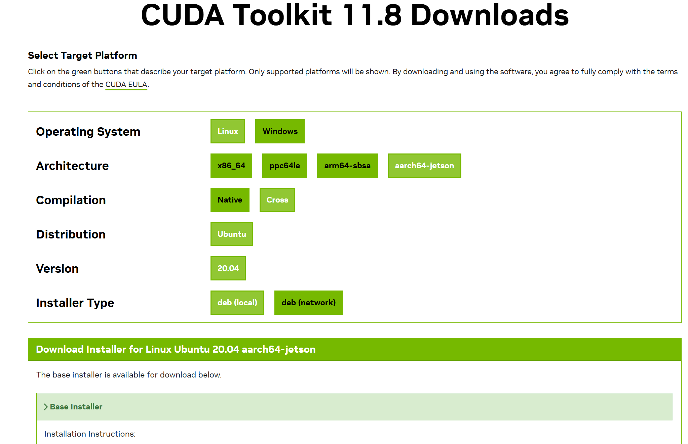

# README

## 安装 cuda cross toolkit

首先进 [CUDA Toolkit 11.8 Downloads](https://developer.nvidia.com/cuda-11-8-0-download-archive) 页，选择 cross 平台：

> 这里只有 ubuntu 20.04 的，而我们的 docker 是 22.04，可以先试用一下。



```bash
wget https://developer.download.nvidia.com/compute/cuda/11.8.0/local_installers/cuda-repo-cross-aarch64-ubuntu2004-11-8-local_11.8.0-1_all.deb
sudo dpkg -i cuda-repo-cross-aarch64-ubuntu2004-11-8-local_11.8.0-1_all.deb
sudo cp /var/cuda-repo-cross-aarch64-ubuntu2004-11-8-local/cuda-*-keyring.gpg /usr/share/keyrings/
sudo apt-get update
sudo apt-get -y install cuda-cross-aarch64
```
