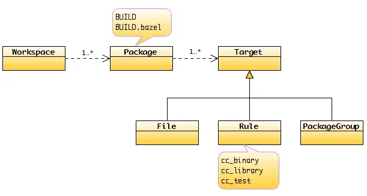
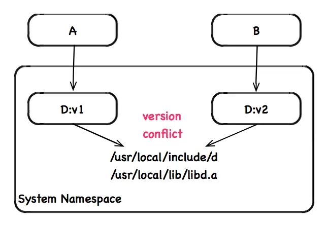
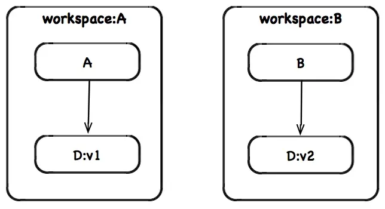
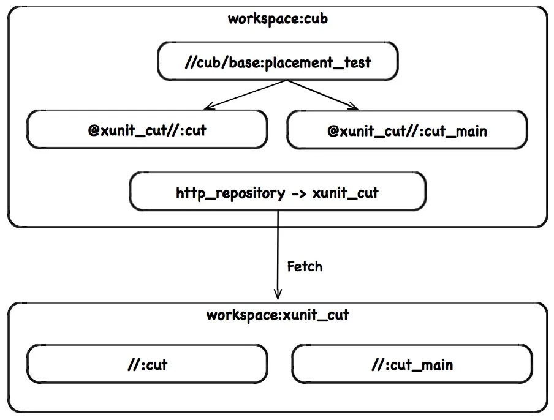
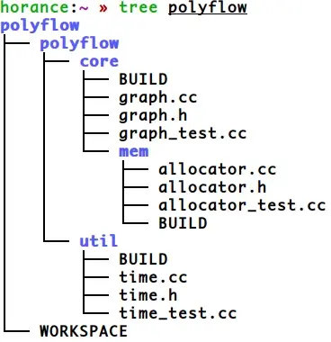

# Bazel

## 简介

Bazel 是一个由 Google 开发的构建工具，旨在帮助开发者更高效地构建和测试软件项目。

* **支持多种编程语言** ：包括 C++、Java 和 Python 等
* **基于规则的构建系统** ：用户通过定义一系列规则来描述构建和测试过程
* **更快地进行增量式构建** ：BAZEL 只会重新构建已修改的部分，而不需要重新构建整个项目，另外 BAZEL 的缓存机制也可以避免重复构建
* **支持分布式构建和测试** ：BAZEL 支持同时在多台计算机上进行构建和测试，从而更快地完成整个过程
* **良好的可扩展性** ：可以方便地添加自定义构建规则，支持插件等扩展

## 基本概念

BAZEL 的核心模型非常简单，一个 Workspace 包含零个或多个 Package，每个 Package 包含零个或多个 Target。其中 Target 包含 File、Rule 和 PackageGroup 三种类型。



## Workspace

一般我们在项目的根目录创建一个 WORKSPACE 文件，Bazel 据此在构建过程中创建一个隔离的工作区（Workspace），用于标识该项目的起始位置。

WORKSPACE.bazel 文件用于声明项目名称和项目外部依赖，如果项目不存在外部依赖，WORKSPACE 的内容可为空。

### 1. Workspace 作为隔离区

WORKSPACE 为项目构建提供了一个安全的隔离环境。

举个例子，假设本地存在两个待构建的项目 A 和 B，它们都依赖于第三方库 D 并且 A 依赖 D 的 v1 版本而 B 依赖 D 的 v2 版本。此时系统目录 /usr/local/include 和 /usr/local/lib 中应该放 D 的哪个版本呢？



归功于 Bazel 良好的隔离性，各个项目的工作区都是独立的，它们将所有的依赖控制在各自的工作区，避免了第三方库的名字和版本冲突。



### 2. WORKSPACE 作为代码仓库

一般我们将当前工作区所在目录称为代码仓库（Repository），它包含了所有待构建的源文件、数据和构建脚本。当前代码仓库由匿名的 @ 标识，而外部依赖的代码仓库由 @external_repo 标识。

例如在当前代码仓库下，目标 //cub/base:placement_test 等价于 @//cub/base:placement_test。一般我们都会略去 @ 前缀。

而对于外部依赖的代码仓库，必须在当前代码仓库的 WORKSPACE 中显式地通过 http_repository 声明外部以来的名称 @xunit_cut，并在当前代码仓库中使用 @xunit_cut 引用该外部依赖的代码仓库。



### 3. 最佳实践

按照 BAZEL 的惯例，一般需要在项目根目录创建一个与项目同名的文件夹，以此定义项目命名空间的起始位置。

例如下图是一个名为 polyflow 的项目：



* 在项目根目录创建 WORKSPACE 文件以及同名的 polyflow 文件夹
* 在 polyflow 文件夹中根据系统架构分解为两个基本的模块 core 和 util
* BAZEL 强烈建议实现文件、测试文件和头文件放在同一个目录，而不是分开放在 include、src 和 test 文件夹中

## Package

对于含有 BUILD 或 BUILD.bazel 文件的目录，BAZEL 在构建时将其标识为 Package。如果一个目录不含 BUILD 或 BUILD.bazel，那么它就是一个纯粹的目录，隶属于最近的父包（包含 BUILD 或 BUILD.bazel 文件）。

## Target

在一个 Package 中可以包含零个或多个目标（Target）。

一般目标包括文件（File）、规则（Rule） 和包集合（Package Group）三种基本类型。

### 1. 文件

文件包括源文件和派生文件两种类型：

* 源文件：程序员自己写的头文件和实现文件
* 派生文件：protoc 自动生成的头文件和实现文件

### 2. 规则

在 BUILD 文件中，可以定义零个或多个规则。规则由输入、输出和动作三元组构成。

* 规则输入的文件可能是源文件也可能是其他规则生成的派生文件，常通过 `srcs` 或 `hdrs` 等属性表示
* 规则输出的文件必然是派生文件，且必然与该规则属于同一个包；规则输入的文件可以来自其他包
* 规则的输入也可以是规则，常通过 deps 表示

通过规则之间的依赖关系，构成了运行时的 DAG 图。一般而言依赖关系具有多种表现方式，而且与编程语言及其相关。例如在编译时 A 依赖于 B 的头文件，在链接时 A 依赖于 B 的符号，在运行时 A 依赖于 B 的数据。

### 3. 包集合

包集合较为特殊，它标识一组包。它由 package_group 定义。使用包集合，可以很方便地将某一个规则的可见性一并赋予给该包集合，使得该集合所包含的包都可以访问该规则。

### 4. 标签

每个目标都存在一个全局名字，被称为标签（Label），由如下三个部分组成：

> 注意 `@repo_name`、`@package_name` 、`:` 和 `target_name` 在一些特殊场景下都可以省略。


举个例子，在 cub/base/BUILD 中定义了一个 placement 的基础类库，它基本覆盖了所有形态的标签格式：

```bazel
package(
    default_visibility = [
        "//visibility:public",
    ],
)

cc_library(
    name = "placement",
    hdrs = ["placement.h"],
)

cc_test(
    name = "placement_test",
    srcs = ["placement_test.cc"],
    deps = [
        ":placement",
        "//cub/algo:loop",
        "//cub/dci",
        "@xunit_cut//:cut",
        "@xunit_cut//:cut_main",
    ],
)
```

#### 4.1 仓库名字

标签 `@xunit_cut//:cut` 来自于第三方库 `xunit_cut`，因此需要显式地加上域名。

外部依赖的名称定义于 WORKSPACE 之中。按照惯例，域名推荐使用 DNS 名称，例如 github_horanceliu_cut，将极大降低包的名字冲突概率。

```bazel
http_archive(
    name = "xunit_cut",
    sha256 = "f7c2c339a5ab06dc1d16cb03b157a96e6c591f9833f5c072f56af4a8f8013b53",
    strip_prefix = "cut-master",
    urls = [
        "https://github.com/horance-liu/cut/archive/master.tar.gz",
    ],
)
```

其中 sha256 的值可以通过执行如下命令得到，它有效地保证构建的可重入性：

```bash
curl -L https://github.com/horance-liu/cut/archive/master.tar.gz | sha256sum
```

##### 4.2 文件标签

在规则 `placement_test` 的 `srcs` 属性定义中，标签 `placement_test.cc` 略去了域名和包名，及其可选的冒号。也就是说，在 `//cub/base/BUILD` 中，如下标签是等价的。

```bash
//cub/base:placement_test.cc
:placement_test.cc
placement_test.cc # 推荐
```

需要注意的是，Bazel 一律使用 Label 引用文件，而不能使用传统的文件系统的路径名，例如，`..` 或 `.` 形式的相对路径，或绝对路径。

##### 4.3 规则标签

而在规则 `placement_test` 的 deps 属性定义中，标签 `:placement` 略去了域名和包名，但保留了冒号，用于显式地标识它是一个规则。也就是说，在 `//cub/base/BUILD` 中，如下标签是等价的。

```bash
//cub/base:placement
:placement  # 推荐
placement
```

但是，标签 `//cub/algo:loop` 来自于另一个包 `cub/algo`，所以需要显式地给出全路径。

##### 4.4 同名标签

特殊地，标签 `//cub/dci` 等价于 `//cub/dci:dci`。也就是说，当 `target_name` 等于其目录名，则常常略去 `target_name`。其中，标签 `//cub/dci:dci` 定义如下。

```bazel
# cub/dci/BUILD
package(
    default_visibility = [    
        "//visibility:public",    
    ],
)

cc_library(
    name = "dci",
    hdrs = ["role.h"],
)
```

注意，标签 `//cub/dci` 切忌不可略去 `//`，标签名以 `//` 开头，而 `cub/dci` 仅仅为包名。也就是说，在同一个 `//cub/dci/BUILD` 文件中，如下标签都是等价的。

```bash
//cub/dci:dci
//cub/dci
:dci
dci
```
